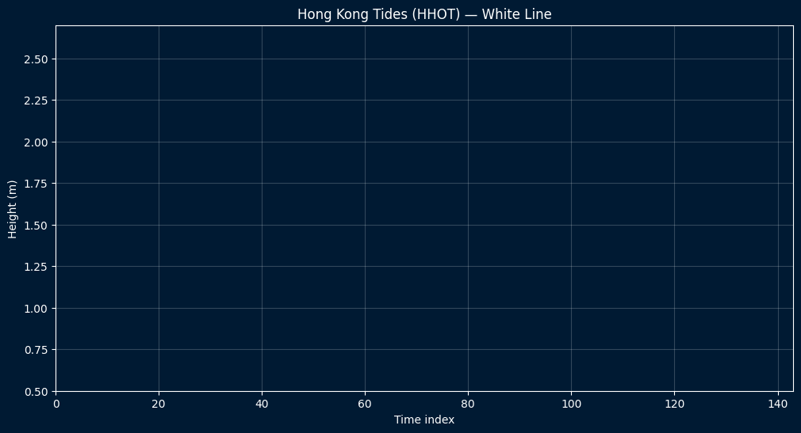

# Hong Kong Tides Visualization 🌊

Animated visualization of tidal height data for Chek Lap Kok (E), Hong Kong (2025). 

Source data: Hong Kong Observatory – Tidal Information 2025  
https://www.hko.gov.hk/tide/eCLKtext2025.html

The goal is to explore the boundary between precise data visualization and minimalist, almost ambient, animation design.

## Preview
<!-- If you commit the generated GIF remove the comment and ensure path matches -->
<!--  -->

## Features
* Parse & clean raw HKO tide table into a tidy `pandas` DataFrame.
* Generate progressive white-line animation over dark ocean-themed palette.
* Adjustable FPS, duration, and output path via CLI arguments.
* Automatic creation of output directory.
* Designed to be easily extended (MP4 export, color themes, progress bar, etc.).

## Quick Start
```bash
pip install -r requirements.txt
python src/main.py
```
Result: `output/hkotide.gif`

## Command-Line Usage
```bash
python src/main.py --csv data/hhot_subset.csv --out output/hkotide.gif --fps 24 --duration 8
```

### Arguments
| Argument | Default | Description |
|----------|---------|-------------|
| `--csv` | `data/hhot_subset.csv` | Input CSV with columns `datetime,height_m` |
| `--out` | `output/hkotide.gif` | Output GIF file path (folders auto-created) |
| `--fps` | `24` | Frames per second of the animation |
| `--duration` | `8` | Total animation length in seconds |

## Data Format
Expected CSV columns:
```
datetime,height_m
2025-01-01 00:00:00,2.31
...
```

## Roadmap / Ideas
- Progress bar during frame generation (`tqdm`).
- Timestamp labels instead of simple index.
- Optional MP4 export (via `imageio` or `matplotlib.animation`).
- Color theme variants (dawn / night / high-contrast).
- File size optimization (palette quantization).

## Development in VS Code
1. Clone the repo & open in VS Code.
2. Create & activate a virtual env (optional).
3. Install requirements (see Quick Start).
4. Run or debug `src/main.py`.
5. Adjust arguments in a launch configuration or via terminal.

## License
MIT – see `LICENSE`.

## Attribution
Tidal height data © Hong Kong Observatory (HKO). Use responsibly; check original source for official or mission-critical usage.

## Contributing
Issues & pull requests welcome. Feel free to propose enhancements listed in the roadmap or new ideas.

